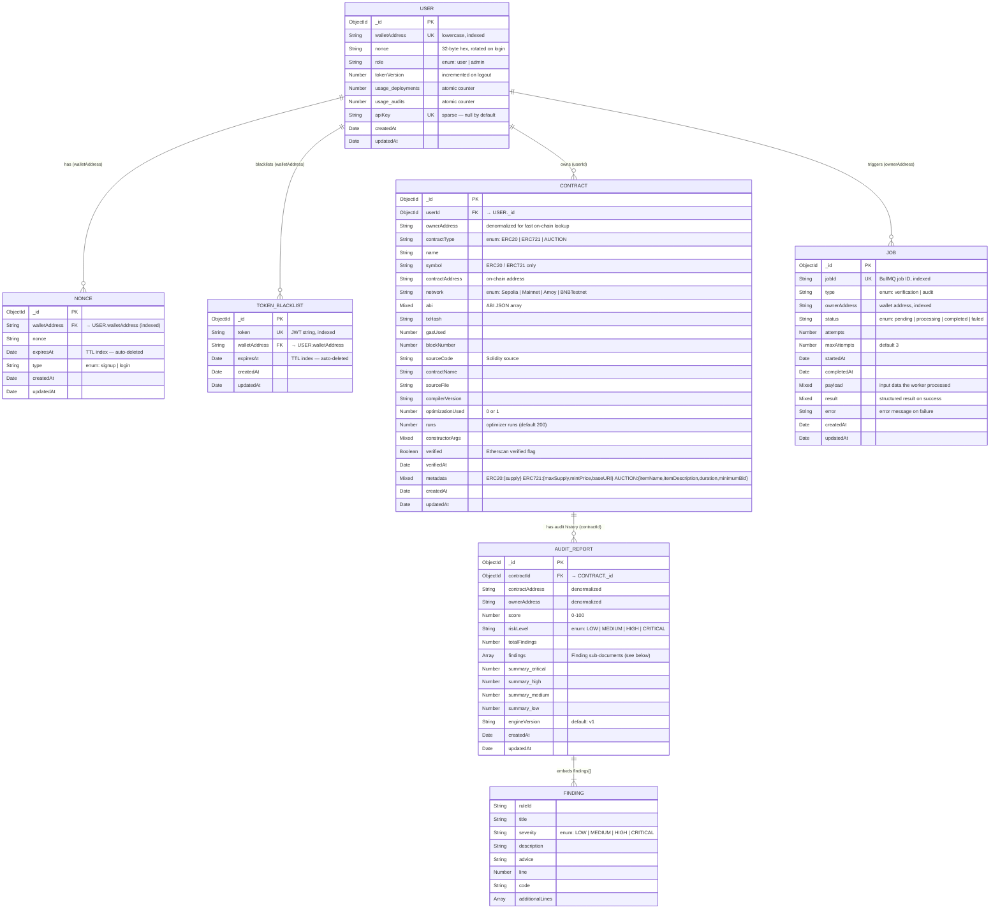
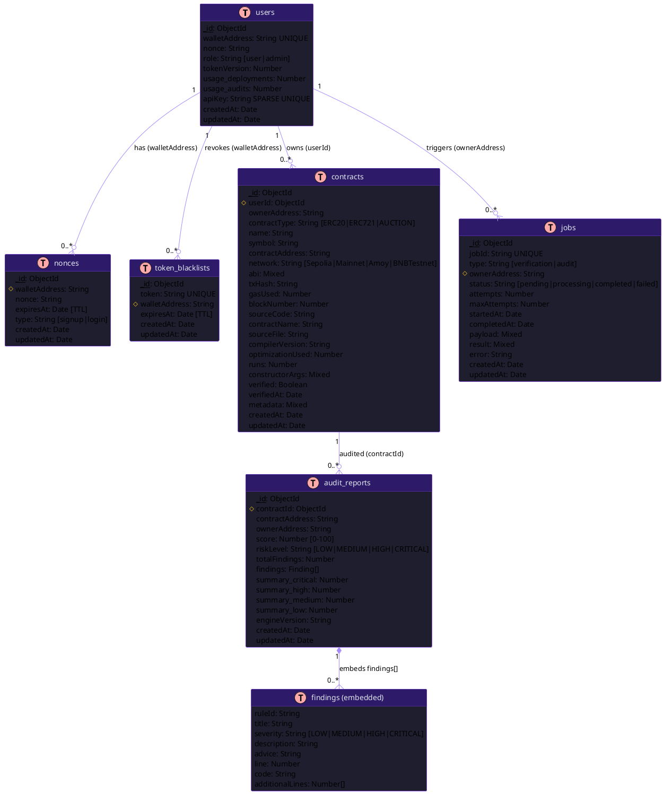

# AutoCon — Database Schema

## Mermaid ER Diagram

Paste this into **[Mermaid Live Editor](https://mermaid.live)**, **dbdiagram.io** (as the DBML below), or **draw.io** (import Mermaid).



---

## DBML  (for dbdiagram.io — paste at https://dbdiagram.io)

```dbml
// AutoCon — MongoDB Schema represented in DBML
// Collections modelled as tables; Mixed/Array types noted in comments.

Table users {
  _id           ObjectId [pk, note: 'Auto-generated']
  walletAddress String   [unique, not null, note: 'Ethereum address, lowercase']
  nonce         String   [not null, note: '32-byte hex; rotated on every login']
  role          String   [not null, default: 'user', note: 'Enum: user | admin']
  tokenVersion  Int      [not null, default: 0]
  usage_deployments Int  [not null, default: 0]
  usage_audits  Int      [not null, default: 0]
  apiKey        String   [unique, note: 'Sparse — null by default']
  createdAt     DateTime
  updatedAt     DateTime
}

Table nonces {
  _id           ObjectId [pk]
  walletAddress String   [not null, ref: > users.walletAddress, note: 'Indexed']
  nonce         String   [not null]
  expiresAt     DateTime [not null, note: 'TTL index — document auto-deleted at this time']
  type          String   [default: 'signup', note: 'Enum: signup | login']
  createdAt     DateTime
  updatedAt     DateTime

  indexes {
    (walletAddress, type) [unique]
  }
}

Table token_blacklists {
  _id           ObjectId [pk]
  token         String   [unique, not null, note: 'JWT string']
  walletAddress String   [not null, ref: > users.walletAddress]
  expiresAt     DateTime [not null, note: 'TTL index — auto-deleted']
  createdAt     DateTime
  updatedAt     DateTime
}

Table contracts {
  _id              ObjectId [pk]
  userId           ObjectId [not null, ref: > users._id, note: 'FK → users._id']
  ownerAddress     String   [not null, note: 'Denormalized wallet address']
  contractType     String   [not null, note: 'Enum: ERC20 | ERC721 | AUCTION']
  name             String   [not null]
  symbol           String   [note: 'ERC20 / ERC721 ticker symbol']
  contractAddress  String   [not null, note: 'On-chain deployed address']
  network          String   [default: 'Sepolia', note: 'Enum: Sepolia | Mainnet | Amoy | BNBTestnet']
  abi              JSON     [note: 'Contract ABI array']
  txHash           String   [note: 'Deployment transaction hash']
  gasUsed          Int
  blockNumber      Int
  sourceCode       String   [note: 'Solidity source code string']
  contractName     String
  sourceFile       String
  compilerVersion  String
  optimizationUsed Int      [default: 1]
  runs             Int      [default: 200]
  constructorArgs  JSON     [note: 'ABI-encoded constructor arguments']
  verified         Boolean  [default: false]
  verifiedAt       DateTime
  metadata         JSON     [note: 'ERC20:{supply} ERC721:{maxSupply,mintPrice,baseURI} AUCTION:{itemName,itemDescription,duration,minimumBid}']
  createdAt        DateTime
  updatedAt        DateTime

  indexes {
    (contractAddress, network) [unique]
    (userId, createdAt)
    (ownerAddress, createdAt)
    (userId, contractType)
  }
}

Table audit_reports {
  _id             ObjectId [pk]
  contractId      ObjectId [not null, ref: > contracts._id]
  contractAddress String   [note: 'Denormalized for display']
  ownerAddress    String   [not null, note: 'Denormalized wallet']
  score           Int      [not null, note: '0-100']
  riskLevel       String   [not null, note: 'Enum: LOW | MEDIUM | HIGH | CRITICAL']
  totalFindings   Int      [default: 0]
  findings        JSON     [note: 'Array of Finding sub-documents — see findings table']
  summary_critical Int     [default: 0]
  summary_high     Int     [default: 0]
  summary_medium   Int     [default: 0]
  summary_low      Int     [default: 0]
  engineVersion   String   [default: 'v1']
  createdAt       DateTime
  updatedAt       DateTime

  indexes {
    (contractId, createdAt)
    (ownerAddress, createdAt)
  }
}

// Embedded sub-document inside audit_reports.findings[]
// Shown as a separate table for documentation clarity only.
Table findings {
  ruleId          String
  title           String
  severity        String  [note: 'Enum: LOW | MEDIUM | HIGH | CRITICAL']
  description     String
  advice          String
  line            Int
  code            String
  additionalLines JSON    [note: 'Array of line numbers']
}

Table jobs {
  _id          ObjectId [pk]
  jobId        String   [unique, not null, note: 'BullMQ job ID']
  type         String   [not null, note: 'Enum: verification | audit']
  ownerAddress String   [not null, ref: > users.walletAddress]
  status       String   [default: 'pending', note: 'Enum: pending | processing | completed | failed']
  attempts     Int      [default: 0]
  maxAttempts  Int      [default: 3]
  startedAt    DateTime
  completedAt  DateTime
  payload      JSON     [note: 'Input data the worker processed']
  result       JSON     [note: 'Structured result on success']
  error        String   [note: 'Error message on failure']
  createdAt    DateTime
  updatedAt    DateTime

  indexes {
    (ownerAddress, createdAt)
    (type, status)
  }
}
```

---

## PlantUML  (for PlantUML Online / IntelliJ / VS Code)

Paste at **https://www.plantuml.com/plantuml/uml/**



---

## Recommended Platforms

| Platform | Format to Use | Link |
|---|---|---|
| **Mermaid Live** | Mermaid block above | https://mermaid.live |
| **dbdiagram.io** | DBML block above | https://dbdiagram.io |
| **PlantUML Online** | PlantUML block above | https://www.plantuml.com/plantuml/uml/ |
| **draw.io / diagrams.net** | Import → From Text → Mermaid | https://app.diagrams.net |
| **Lucidchart** | Copy DBML or Mermaid | https://lucidchart.com |
| **ERD.plus** | Manual entry from DBML | https://erdplus.com |
